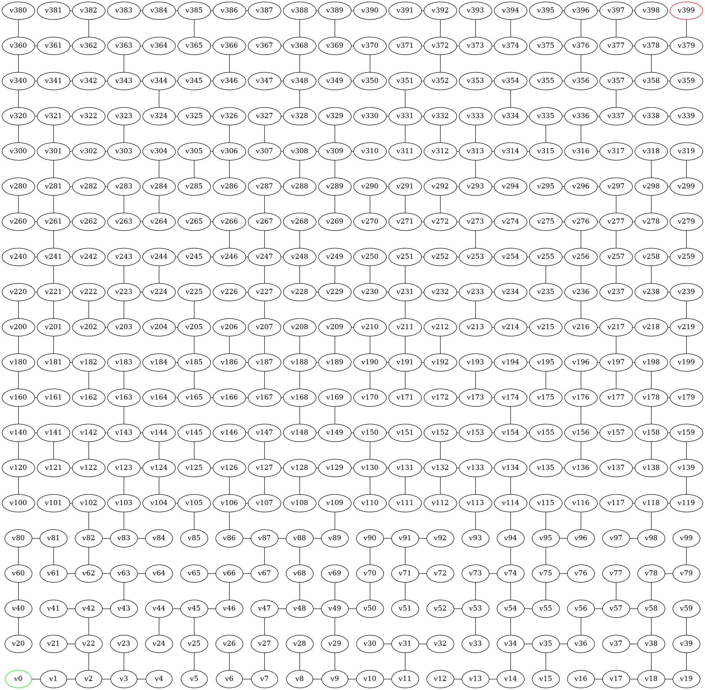
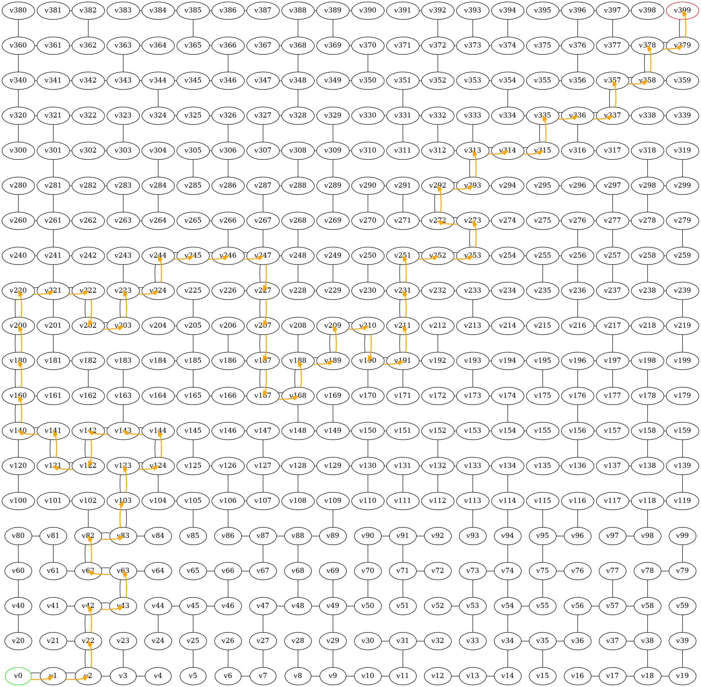

# graph-maze-c


## 📑 Содержание

- [Описание](#-описание)
- [Сетап](#-сетап)
- [Сборка проекта](#-сборка-проекта)
- [Возможности программы](#-возможности-программы)
- [Визуализация лабиринта](#-визуализация-лабиринта)
- [Документация](#-документация)

## 📖 Описание

Этот проект представляет собой реализацию лабиринта с использованием графов на языке `C`. 

## ⚙️ Сетап

Для более удобного визуального отображения дерева в формате `.dot` рекомендуется установить расширение 
[Graphviz Interactive Preview для Visual Studio Code](https://marketplace.visualstudio.com/items/?itemName=tintinweb.graphviz-interactive-preview)

Для проверки отсутствие утечек памяти рекомендуется использовать санитайзер `valgrind`

## 🛠️ Сборка проекта

Для сборки проекта используется `make`.

### Команда сборки:

```bash
make
```
### Запуск программы:

```bash
valgrind ./bin/lab
```

## 🧩 Возможности программы
Программа предоставляет следующий функционал через консольное меню:
- Добавление новой вершины
- Вставка ребра между двумя вершинами
- Удаление заданной вершины
- Удаление заданного ребра
- Изменение данных, асоциированных с заданной вершиной (изменение типа комнаты)
- Вывод графа в виде списков смежности
- Генерация графа дерева в формате .dot для Graphviz
- Проверка достижимости хотя бы одного из выходов из указанной точки входа (`поиск в глубину`)
- Поиск кратчайшего пути между указанным входом и указанным выходом (`алгоритм Дейкстры`)
- Определение ближайшего, к указанному входу, выхода и расстояния до него (`алгоритм Флойда-Уоршалла`)
- Считывание графа из текстового файла
- Запись графа в текстовый файл
- Обработка графа для каждой операции с записью результатов в .yaml файл

## 🗺️ Визуализация лабиринта

Для генерации лабиринтов с большим количеством комнат был использован [датасет c Kaggle](https://www.kaggle.com/datasets/emadehsan/rectangular-maze-kruskals-spanning-tree-algorithm/data)

Для корректного отображения лабиринта в формате `.dot` рекомендуется использовать режим `neato` в Graphviz
```bash
neato -Tpng input.dot -o output.png
```

**Пример изображения лабиринта, считанного из текстового файла [./examples/graphs_txt/test1.txt](./examples/graphs_txt/test1.txt):**



**Пример результата работы алгоритма Дейкстры для нахождения кратчайшего пути:**



## 📚 Документация

Подробное описание проекта можно найти в следующих документах:
- [general_task.pdf](./docs/general_task.pdf)
- [individual_task.pdf](./docs/individual_task.pdf)